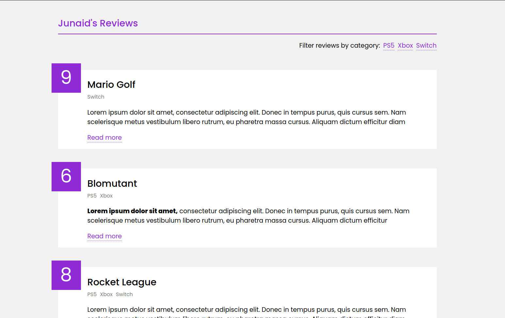

## Strapi Tutorial

## Stack = React + GraphQl + Strapi

### Tutorial : :link: https://www.youtube.com/playlist?list=PL4cUxeGkcC9h6OY8_8Oq6JerWqsKdAPxn



## Steps

#### Start

##### Backend

- Create project directory `mkdir strapi-project`
- Create strapi backend `npx create-strapi-app backend`
- - Select Quickstart (Press enter)
- - Select No template (type n and enter)

---

#### Admin Area

- Create Admin Account
- If you want to run strapi server again
- - Navigate to backend `cd backend`
- - Run `npm run develop`

---

#### Content Types

- Collection Types (You'll have more than one)
- Single Type (Unique piece of content example: Home)
- Component (Reusable fields)

---

#### Creating Content Types

- Open Strapi admin panel
- Click `Content-Types-Builder`
- Click `create new collection type`
- - Give Singular Display name `review`
- - Click `continue`

---

#### Adding fields to Collection

- Select field for your collection type `Click Text`
- Name Field `title`
- Set Type `Short text`
- Click `advanced settings`
- Make it `required, unique`
- Click `add another field` and add fields and click `finish`
- Click `Save` to save Content type

---

#### Adding Entries To Collection

- Click Collection `Click Reviews from left panel`
- Click add `add new review`
- - title `Mario Golf`
- - Body `some text`
- - Rating `9`
- - Click Save and Click Publish to make it Public

---

#### Strapi API Routes

- You can see api routes strapi created inside backend/api/collectionName/config/routes.json

---

#### Permissions and Auth Requests

- Click Settings > Roles > Public
- Permissions (Check all boxes that are to be displayed to un auth users)
- Check `find and findone`
- Click `Save`

---

- Click Settings > Roles > Authenticated
- Permissions (For authenticated users)
- Check All
- Save

---

#### Creating User

- Click Users
- Click `Add new user`
- Add details
- Turn on `confirmed`
- role `authenticated`

---

---

##### Frontend

- Develop Frontend
- Fetch Data

### Strapi with GraphQl

#### Go to strapi admin area

- Click Marketplace
- Click Download Graphql (will install graphql plugin on strapi)
- Graphql Schema generated at path (backend/exports/graphql/)

---

#### Graphql playground

- - Go to localhost:1337/graphql
- - Test queries
- Install Dependencies

---

#### Setup Graphql and apollo server

- ApolloClient: used to create new connections to GQL server
- InMemoryCache: used by apollo client to cache responses from GQL server
- ApolloProvider: wrapper to use apollo connection

---

- Import {ApolloClient, InMemoryCache, ApolloProvider}
- create apollo client and set uri and cache
- Wrap app with provider and set client

#### Using Graphql inside App

- useQuery: used to send query to GQL server
- gql: used by apollo to convert query string to format to use

---

- import {useQuery, gql}
- Query
- - const REVIEWS = gql`query here`
- - send query `const {loading, error, data} = useQuery(REVIEWS)`
- - data will be inside `data.reviews`

---

- Single Record Query

```
const QUERY_NAME = gql`
    query Name($id: ID!){
        name(id: $id) {
            fields ...
        }
    }
`


const {loading, error, data} = useQuery(QUERY_NAME, {
    variables: {id: id}
})
```

---

#### Making Relational data

- Go to strapi admin panel
- Select contenty type
- Create `category` collection of type text and add 3 fields

---

- Go to content type builder
- Select Review Content type
- Click add another field to this collection
- Select `Relation`
- field name `category`
- Select `Category` from dropdown
- Select type of relation `many to many relation`
- Field name `reviews`

---

- Put each review in a category
- Select Reviews
- Select individual review
- Choose categories for it

---

- Go to settings > roles > public
- select find and findone for category

### Install Dependencies

```
npm i @apollo/client graphql react-markdown
```

## Tech Stack

- ReactJs
- Strapi
- GraphQl (Apollo Client)
